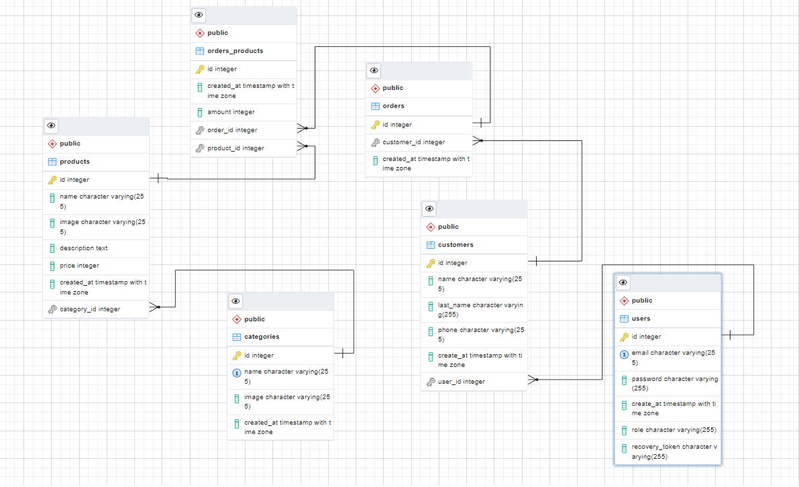

# E-commerce Backend con Node.js y base de datos PostgreSQL

Este es un proyecto desarrollado del lado del servidor con Node.js, logrando una persistencia de datos con PostgreSQL.
En el mismo se da solucion a diversos problemas del lado del backend como:

- Resolver problemas de **migraciones** con **Sequelize**, **Heroku** y **Node.js**
- Trabajo en **Postgres** con interfaces graficas, terminal y codigo Javascript
- Configuracion de entorno de desarrollo con **Docker**
- Manejo de **API REST** con Express.js
- Autenticacion y autorizacion de usuarios
- Integracion de **Passport.js** y **JSON Web Tokens** a Express.js
- **Proteccion** de rutas y control de roles
- **Envio de emails** con tokens para recupero de contraseñas

## Routes

#### 1. El router base _'/api/v1/auth'_ ejecuta diferentes acciones en los siguientes endpoint:

- `POST: '/login'` - genera login de usuario previamente cargado desde las routes de **user**, al mismo se le debera pasar _email_ y _password_ en el body de la request, en la response de este endpoint se otorgara un **token** de acceso a las rutas protegidas
- `POST: '/recovery'` - al pasar el correo electronico al cual se le quiere cambiar la contraseña de login, se recibira al mismo un link el cual contiene el token necesario para restablecer la constrasenha
- `POST: '/change-password'` - por medio de este endpoint pasandole el token y newPassword se podra realizar el cambio de contrasenha

#### 2. El router base _'/api/v1/products'_ implementa las siguientes funcionalidades:

- `GET: '/'` - permite listar todos los productos disponibles siendo posible realizar paginacion y filtrado por **query params** colocando valores para _limit y offset_, _price_, _price_min_ y _price_max_.
  - ejemplo de Request URL:
    ```console
    https://enigmatic-journey-93971.herokuapp.com/api/v1/products?limit=5&offset=0
    ```
- `GET: '/:id'` - Permite listar un producto por su id
- `POST: '/'` - Para incorporar productos al listado(se necesita primero tener creada una categoria de productos)
- `PATCH: '/:id'` - Para realizar un update con informacion parcial del producto
- `DELETE: '/:id'` - Borra un producto por su id

#### 3. El router base _'/api/v1/users'_:

- `GET: '/'` - Lista los ususarios
- `GET: '/:id'` - Muestra un usuario por su id
- `POST: '/'` - Genera el registro de un usuario, el valor por defecto de role es 'customer'
- `PATCH: '/:id'` - Para realizar un update con informacion del usuario. **No esta permitido** hacer la modificacion de password ni role por medio de este endpoint
- `DELETE: '/:id'` - Borrado de usuario. Tener en cuenta la relacion con la tabla _customers_

#### 4. El router base _'/api/v1/categories'_:

- `GET: '/'` - Lista las categorias
- `GET: '/:id'` - Muestra categoria filtrada por su numero de id, la categoria seleccionada tambien retornara la asociacion debida a los productos contenidos dentro de si misma.
- `POST: '/'` - Genera el registro de una categoria, esta es una ruta protegida por lo que se le debe pasar el **token** generado en el **login**

#### 5. El router base _'/api/v1/customers'_:

- `GET: '/'` - Lista los customers, los valores retornados ademas cuentan con las asociaciones a la tabla users
- `POST: '/'` - Genera el registro de un customer pasandole en el body un _userId_ ya existente
- `POST: '/'` - Para crear un customer junto con un usuario nuevo, para esto en lugar de pasar un _userId_, se debe pasar _"user"_ en el body junto con su email y password
- `DELETE: '/:id'` - Borra un customer por id

#### 6. El router base _'/api/v1/orders'_:

- `GET: '/'` - Lista todas las orders
- `POST: '/'` - Crea un order haciendo uso del token que se le debera pasar, de este mismo se extrae el sub del payload
- `POST: '/add-item'` - Agrega un Item al orders, ejemplo del schema:
  ```console
  {
    "orderId":7,
    "productId":2,
    "amount":2
  }
  ```

#### 7. El router base _'/api/v1/profile'_:

- `GET: '/my-orders'` - Esta ruta otorga la orden de compra con todos los productos del cliente, al ser esta una ruta protegida debe de ser pasado el **token** otorgado al momento de realizar el login en el _header_ de la _request_

## Deploy en Heroku

🔗[e-commerce](https://enigmatic-journey-93971.herokuapp.com/)

## Como usarlo

Para realizar la prueba de cada uno de los endpoints anteriormente mencionados, se puede usar _postman_, _insomnia_ o cualquier _cliente REST_ para facilitar las consultas a dicha API REST

```console
https://enigmatic-journey-93971.herokuapp.com/
```

## DER de la base de datos utilizada


🔗[enlace a imagen - drive](https://drive.google.com/file/d/1XTXpHl6QewMfl-zrjJrHTbTvX0kcaKy1/view?pli=1)

## Estado

Frontend y doc. con Swagger en desarrollo... 👨🏻‍💻⏳🛠️🚧
